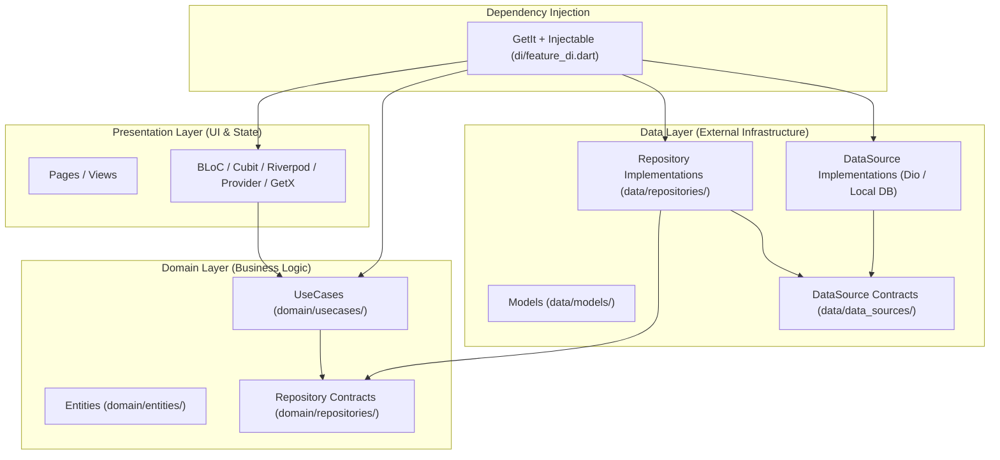

# 🏗️ Clean Architecture Guide

`flutter_archkit` provides an enterprise-grade **Clean Architecture** scaffolding engine. It strictly follows the **Dependency Rule** where inner layers (Domain) have no knowledge of outer layers (Data & Presentation).

---

## 📐 Architecture Overview

Clean Architecture separates code into distinct layers with explicit responsibilities:



---

## 📁 Directory Structure (`lib/features/<name>/`)

When scaffolding a feature using Clean Architecture (`archkit feature <name> -a Clean`), `flutter_archkit` creates the following directory layout:

```text
lib/features/auth/
├── data/
│   ├── data_sources/
│   │   ├── auth_remote_datasource.dart       # Data source interface
│   │   └── auth_remote_datasource_impl.dart  # Dio HTTP network client implementation
│   ├── models/
│   │   └── auth_model.dart                   # Data transfer object with JSON serialization
│   └── repositories/
│       └── auth_repository_impl.dart         # Repository implementation delegating to data sources
├── di/
│   └── auth_di.dart                          # Feature Dependency Injection locator
├── domain/
│   ├── entities/
│   │   └── auth_entity.dart                  # Core business entity
│   ├── repositories/
│   │   └── auth_repository.dart              # Domain repository contract
│   └── usecases/
│       └── auth_usecase.dart                 # Business use-case implementation
└── presentation/
    ├── bloc/ (or cubit / riverpod / provider / controllers)
    │   ├── auth_bloc.dart                    # State management controller
    │   ├── auth_event.dart                   # BLoC event definitions
    │   └── auth_state.dart                   # BLoC state definitions
    └── page/
        └── auth_page.dart                    # UI View Widget
```

---

## ⚡ Scaffolding Commands

### 1. New Project Creation
```bash
archkit create my_app -a Clean -s Bloc
```

### 2. Add Clean Feature Module
```bash
# Interactive or using flags
archkit feature auth --architecture Clean --state-management Riverpod

# Quick shortcut (uses .metadata project settings)
archkit -f auth
```

---

## 🧩 State Management Implementations

`flutter_archkit` supports 5 state management options in Clean Architecture:

### 1. BLoC (`flutter_bloc`)
`lib/features/auth/presentation/bloc/auth_bloc.dart`:
```dart
import 'package:flutter_bloc/flutter_bloc.dart';
import '../../domain/usecases/auth_usecase.dart';
import 'auth_event.dart';
import 'auth_state.dart';

class AuthBloc extends Bloc<AuthEvent, AuthState> {
  final AuthUseCase authUseCase;

  AuthBloc({required this.authUseCase}) : super(AuthInitial()) {
    on<LoginEvent>(_onLogin);
  }

  Future<void> _onLogin(LoginEvent event, Emitter<AuthState> emit) async {
    emit(AuthLoading());
    try {
      final result = await authUseCase.login(email: event.email, password: event.password);
      emit(AuthSuccess(result));
    } catch (e) {
      emit(AuthError(e.toString()));
    }
  }
}
```

---

### 2. Cubit (`flutter_bloc`)
`lib/features/auth/presentation/cubit/auth_cubit.dart`:
```dart
import 'package:flutter_bloc/flutter_bloc.dart';
import '../../domain/usecases/auth_usecase.dart';
import 'auth_state.dart';

class AuthCubit extends Cubit<AuthState> {
  final AuthUseCase authUseCase;

  AuthCubit({required this.authUseCase}) : super(AuthInitial());

  Future<void> login({required String email, required String password}) async {
    emit(AuthLoading());
    try {
      final result = await authUseCase.login(email: email, password: password);
      emit(AuthSuccess(result));
    } catch (e) {
      emit(AuthError(e.toString()));
    }
  }
}
```

---

### 3. Riverpod (`flutter_riverpod`)
`lib/features/auth/presentation/riverpod/auth_provider.dart`:
```dart
import 'package:flutter_riverpod/flutter_riverpod.dart';
import '../../di/auth_di.dart';
import '../../domain/usecases/auth_usecase.dart';

class AuthNotifier extends StateNotifier<AsyncValue<String>> {
  final AuthUseCase useCase;

  AuthNotifier(this.useCase) : super(const AsyncValue.loading());

  Future<void> login({required String email, required String password}) async {
    state = const AsyncValue.loading();
    try {
      final result = await useCase.login(email: email, password: password);
      state = AsyncValue.data(result.data ?? '');
    } catch (e, stack) {
      state = AsyncValue.error(e, stack);
    }
  }
}

final authNotifierProvider =
    StateNotifierProvider<AuthNotifier, AsyncValue<String>>((ref) {
  final useCase = AuthDI.provideAuthUseCase();
  return AuthNotifier(useCase);
});
```

---

### 4. Provider (`provider`)
`lib/features/auth/presentation/provider/auth_provider.dart`:
```dart
import 'package:flutter/material.dart';
import '../../domain/usecases/auth_usecase.dart';

class AuthProvider extends ChangeNotifier {
  final AuthUseCase authUseCase;
  bool isLoading = false;
  String? data;
  String? error;

  AuthProvider({required this.authUseCase});

  Future<void> login({required String email, required String password}) async {
    isLoading = true;
    notifyListeners();
    try {
      final result = await authUseCase.login(email: email, password: password);
      data = result.data;
    } catch (e) {
      error = e.toString();
    } finally {
      isLoading = false;
      notifyListeners();
    }
  }
}
```

---

### 5. GetX (`get`)
`lib/features/auth/presentation/controllers/auth_controller.dart`:
```dart
import 'package:get/get.dart';
import '../../domain/usecases/auth_usecase.dart';

class AuthController extends GetxController {
  final AuthUseCase authUseCase;
  var isLoading = false.obs;
  var data = ''.obs;

  AuthController({required this.authUseCase});

  Future<void> login({required String email, required String password}) async {
    isLoading.value = true;
    try {
      final result = await authUseCase.login(email: email, password: password);
      data.value = result.data ?? '';
    } finally {
      isLoading.value = false;
    }
  }
}
```

---

## 💉 Dependency Injection (`GetIt` + `Injectable`)

When scaffolding with DI enabled (`--di`), `flutter_archkit` automatically decorates data sources and repository implementations with `@LazySingleton` and `@Injectable` annotations:

```dart
import 'package:injectable/injectable.dart';
import 'auth_remote_datasource.dart';

@LazySingleton(as: AuthRemoteDataSource)
class AuthRemoteDataSourceImpl implements AuthRemoteDataSource {
  final DioNetwork api = DioNetwork();
  ...
}
```

Use `AuthDI.provideAuthUseCase()` or `GetIt.I<AuthUseCase>()` for clean, testable dependency resolution.
