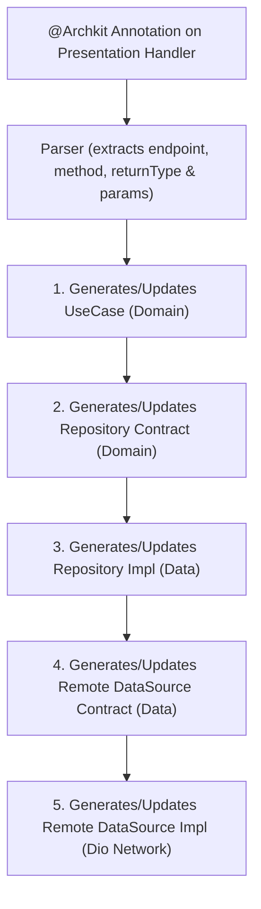

# 🧠 `@Archkit` Presentation-to-Data Code Generator Guide

The `@Archkit` Code Generator is an intelligent tool that eliminates manual boilerplate writing across multi-tier Flutter architectures (Clean, MVVM, MVC).

Instead of manually creating and updating **UseCases**, **Repository Contracts**, **Repository Implementations**, **Data Source Contracts**, and **Network Data Source Implementations** every time you add an API endpoint, `@Archkit` allows you to annotate your UI/Presentation handler and generates the cascading codebase for you!

---

## 🚀 How It Works



---

## 📌 `@Archkit` Annotation Syntax

Import `package:flutter_archkit/flutter_archkit.dart` and annotate functions in your BLoC, Cubit, Riverpod Notifier, ViewModel, or Controller:

```dart
@Archkit(
  endpoint: '/users/update',
  method: 'POST',
  returnType: UserResponse,
)
Future<void> updateUser({required Map<String, dynamic> body}) async {
  final response = await useCase.updateUser(body: body);
}
```

### Metadata Parameters:
| Parameter | Type | Required | Default | Description |
| :--- | :--- | :--- | :--- | :--- |
| **`endpoint`** | `String` | **Yes** | — | Target HTTP API path (e.g. `'/weather'`, `'/users/{id}'`). |
| **`method`** | `String` | No | `'GET'` | HTTP verb: `'GET'`, `'POST'`, `'PUT'`, `'DELETE'`, or `'PATCH'`. |
| **`returnType`** | `dynamic` / `Type` | No | `String` | Return type class / model wrapped in `ApiResponse<T>` (e.g., `UserResponse`, `List<Product>`). |

---

## 💻 CLI Commands

Run code generation on your target feature module or project directory:

```bash
# Run code generator on a target feature
archkit generate --path lib/features/auth

# Or short aliases
archkit g -p lib/features/auth
archkit gen -p lib/features/auth

# Preview proposed method injections without modifying files on disk
archkit g -p lib/features/auth --dry-run
```

---

## 🧬 Cascading Code Generation Examples

### Presentation Layer Input (`lib/features/home/presentation/riverpod/home_provider.dart`)
```dart
import 'package:flutter_riverpod/flutter_riverpod.dart';
import 'package:flutter_archkit/flutter_archkit.dart';
import '../../domain/usecases/home_usecase.dart';

class UserResponse {
  final String id;
  final String name;
  final String email;

  UserResponse({required this.id, required this.name, required this.email});

  factory UserResponse.fromJson(Map<String, dynamic> json) {
    return UserResponse(
      id: json['id'] ?? '',
      name: json['name'] ?? '',
      email: json['email'] ?? '',
    );
  }
}

class HomeNotifier extends StateNotifier<AsyncValue<UserResponse?>> {
  final HomeUseCase useCase;

  HomeNotifier(this.useCase) : super(const AsyncValue.data(null));

  @Archkit(endpoint: "/users/update", method: "POST", returnType: UserResponse)
  Future<void> updateUser({required Map<String, dynamic> body}) async {
    final response = await useCase.updateUser(body: body);
  }

  @Archkit(endpoint: "/users/search", method: "GET", returnType: UserResponse)
  Future<void> searchUser(String query, {required String category}) async {
    final response = await useCase.searchUser(query, category: category);
  }

  @Archkit(endpoint: "/users/{id}", method: "GET", returnType: UserResponse)
  Future<void> getUserById(String id) async {
    final response = await useCase.getUserById(id);
  }
}
```

---

### Automatically Generated Output Across All Layers

#### 1. Domain UseCase (`lib/features/home/domain/usecases/home_usecase.dart`)
```dart
import 'package:test_app/features/home/presentation/riverpod/home_provider.dart';
import 'package:test_app/core/util/api_response.dart';
import '../repositories/home_repository.dart';

class HomeUseCase {
  final HomeRepository repository;

  HomeUseCase({required this.repository});

  Future<ApiResponse<UserResponse>> updateUser({required dynamic body}) async {
    return await repository.updateUser(body: body);
  }

  Future<ApiResponse<UserResponse>> searchUser(dynamic query, {required dynamic category}) async {
    return await repository.searchUser(query, category: category);
  }

  Future<ApiResponse<UserResponse>> getUserById(String id) async {
    return await repository.getUserById(id);
  }
}
```

#### 2. Domain Repository Contract (`lib/features/home/domain/repositories/home_repository.dart`)
```dart
import 'package:test_app/features/home/presentation/riverpod/home_provider.dart';
import 'package:test_app/core/util/api_response.dart';

abstract class HomeRepository {
  Future<ApiResponse<UserResponse>> updateUser({required dynamic body});
  Future<ApiResponse<UserResponse>> searchUser(dynamic query, {required dynamic category});
  Future<ApiResponse<UserResponse>> getUserById(String id);
}
```

#### 3. Data Repository Implementation (`lib/features/home/data/repositories/home_repository_impl.dart`)
```dart
import 'package:test_app/features/home/presentation/riverpod/home_provider.dart';
import 'package:test_app/core/util/api_response.dart';
import '../../domain/repositories/home_repository.dart';
import '../data_sources/home_remote_datasource.dart';

class HomeRepositoryImpl implements HomeRepository {
  final HomeRemoteDataSource remoteDataSource;

  HomeRepositoryImpl({required this.remoteDataSource});

  @override
  Future<ApiResponse<UserResponse>> updateUser({required dynamic body}) async {
    return await remoteDataSource.updateUser(body: body);
  }

  @override
  Future<ApiResponse<UserResponse>> searchUser(dynamic query, {required dynamic category}) async {
    return await remoteDataSource.searchUser(query, category: category);
  }

  @override
  Future<ApiResponse<UserResponse>> getUserById(String id) async {
    return await remoteDataSource.getUserById(id);
  }
}
```

#### 4. Data Source Contract (`lib/features/home/data/data_sources/home_remote_datasource.dart`)
```dart
import 'package:test_app/features/home/presentation/riverpod/home_provider.dart';
import 'package:test_app/core/util/api_response.dart';

abstract class HomeRemoteDataSource {
  Future<ApiResponse<UserResponse>> updateUser({required dynamic body});
  Future<ApiResponse<UserResponse>> searchUser(dynamic query, {required dynamic category});
  Future<ApiResponse<UserResponse>> getUserById(String id);
}
```

#### 5. Data Source Implementation (`lib/features/home/data/data_sources/home_remote_datasource_impl.dart`)
```dart
import 'package:test_app/core/network/dio_network.dart';
import 'package:test_app/features/home/presentation/riverpod/home_provider.dart';
import 'package:test_app/core/util/api_response.dart';
import 'home_remote_datasource.dart';

class HomeRemoteDataSourceImpl implements HomeRemoteDataSource {
  final DioNetwork api = DioNetwork();

  @override
  Future<ApiResponse<UserResponse>> updateUser({required dynamic body}) async {
    return api.post(
      endpoint: '/users/update',
      data: body,
      converter: (response) => UserResponse.fromJson(response),
    );
  }

  @override
  Future<ApiResponse<UserResponse>> searchUser(dynamic query, {required dynamic category}) async {
    return api.get(
      endpoint: '/users/search',
      queryParams: {'query': query, 'category': category},
      converter: (response) => UserResponse.fromJson(response),
    );
  }

  @override
  Future<ApiResponse<UserResponse>> getUserById(String id) async {
    return api.get(
      endpoint: '/users/$id',
      converter: (response) => UserResponse.fromJson(response),
    );
  }
}
```

---

## 🔥 Features & Capabilities

1. **Automatic Imports**: Auto-detects custom models (e.g. `UserResponse`), `ApiResponse<T>`, and `DioNetwork` imports across files.
2. **Smart Parameter Parsing**: Supports positional arguments, required named parameters, and path variables (`/users/{id}`).
3. **Automatic Network Field Injection**: If `final DioNetwork api = DioNetwork();` is missing inside `RemoteDataSourceImpl`, `@Archkit` injects it automatically.
4. **Supports All State Managers**: BLoC, Cubit, Riverpod (`StateNotifier` / `FutureProvider`), Provider (`ChangeNotifier`), and GetX (`GetxController`).
