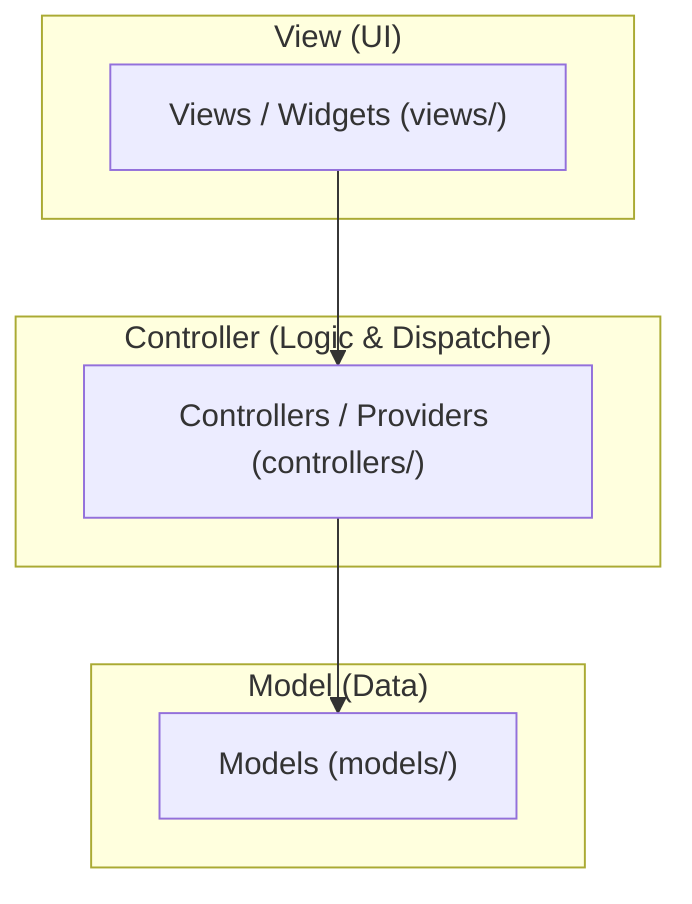

# 🏛️ MVC (Model-View-Controller) Architecture Guide

`flutter_archkit` includes support for **MVC Architecture**, offering a lightweight, pragmatic setup suitable for small-to-medium Flutter applications or rapid prototyping where rigid multi-layer abstractions are unnecessary.

---

## 📐 Architecture Overview

MVC splits responsibilities into three straightforward components:



---

## 📁 Directory Structure (`lib/`)

```text
lib/
├── models/
│   └── product_model.dart        # Data model definitions
├── controllers/                  # Logic & state management controllers
│   └── product_controller.dart
└── views/                        # UI screens & widget tree
    └── product_view.dart
```

---

## ⚡ Scaffolding Commands

### 1. Create MVC Project
```bash
archkit create my_app -a MVC -s GetX
```

### 2. Add MVC Feature Module
```bash
archkit feature products -a MVC -s Cubit
```

---

## 🧩 State Management Implementations

### 1. GetX (`GetxController`)
`lib/controllers/product_controller.dart`:
```dart
import 'package:get/get.dart';
import '../models/product_model.dart';

class ProductController extends GetxController {
  var isLoading = false.obs;
  var productList = <ProductModel>[].obs;

  @override
  void onInit() {
    super.onInit();
    fetchProducts();
  }

  Future<void> fetchProducts() async {
    isLoading.value = true;
    // Network request logic...
    isLoading.value = false;
  }
}
```

---

### 2. Provider (`ChangeNotifier`)
`lib/controllers/product_provider.dart`:
```dart
import 'package:flutter/material.dart';
import '../models/product_model.dart';

class ProductProvider extends ChangeNotifier {
  bool isLoading = false;
  List<ProductModel> products = [];

  Future<void> fetchProducts() async {
    isLoading = true;
    notifyListeners();

    // Network request logic...

    isLoading = false;
    notifyListeners();
  }
}
```

---

### 3. Cubit (`flutter_bloc`)
`lib/controllers/product_cubit.dart`:
```dart
import 'package:flutter_bloc/flutter_bloc.dart';
import 'product_state.dart';

class ProductCubit extends Cubit<ProductState> {
  ProductCubit() : super(ProductInitial());

  Future<void> fetchProducts() async {
    emit(ProductLoading());
    try {
      // Direct controller dispatching logic...
      emit(ProductLoaded());
    } catch (e) {
      emit(ProductError(e.toString()));
    }
  }
}
```

---

## ⚡ `@Archkit` Integration in MVC

When using `@Archkit` inside MVC controllers, `archkit generate` automatically injects network call helper methods using `DioNetwork` directly inside the controller or provider!
