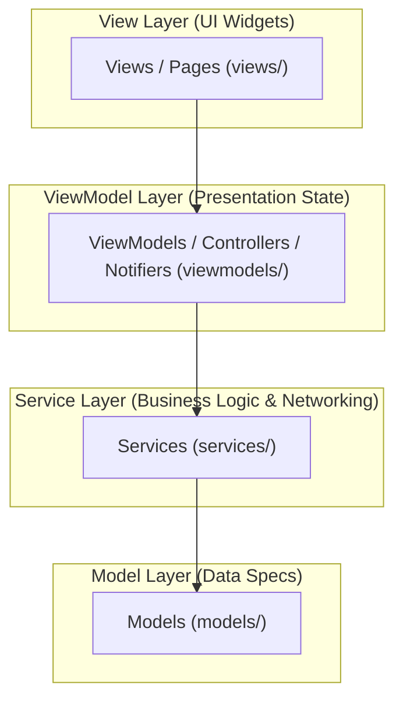

# 🎨 MVVM (Model-View-ViewModel) Architecture Guide

`flutter_archkit` provides native support for **MVVM Architecture**, separating visual presentation (View) from business data handling (Model) using an intermediate reactive state controller (ViewModel) and background services.

---

## 📐 Architecture Overview

MVVM structures your codebase into four distinct layers:



---

## 📁 Directory Structure (`lib/`)

When generating an MVVM app (`archkit create my_app -a MVVM`) or adding feature modules, `flutter_archkit` organizes code into clean domain sub-folders:

```text
lib/
├── models/
│   └── user_model.dart        # Data model representing business entities
├── services/
│   └── user_service.dart      # Business logic & network dispatcher
├── viewmodels/
│   └── user_viewmodel.dart    # ViewModel / StateNotifier managing UI state
└── views/
    └── user_view.dart         # Flutter Widget visual layout
```

---

## ⚡ Scaffolding Commands

### 1. Create MVVM Project
```bash
archkit create my_app --architecture MVVM --state-management Provider
```

### 2. Add MVVM Feature Module
```bash
archkit feature user_profile -a MVVM -s Riverpod
```

---

## 🧩 State Management in MVVM

`flutter_archkit` generates tailored MVVM ViewModels across all 5 state managers:

### 1. Provider (`ChangeNotifier`)
`lib/viewmodels/user_viewmodel.dart`:
```dart
import 'package:flutter/material.dart';
import '../services/user_service.dart';

class UserViewModel extends ChangeNotifier {
  final UserService _service;
  bool isLoading = false;
  String? data;

  UserViewModel({UserService? service}) : _service = service ?? UserService();

  Future<void> fetchData() async {
    isLoading = true;
    notifyListeners();

    data = await _service.fetchUserData();

    isLoading = false;
    notifyListeners();
  }
}
```

---

### 2. Riverpod (`StateNotifier`)
`lib/viewmodels/user_provider.dart`:
```dart
import 'package:flutter_riverpod/flutter_riverpod.dart';
import '../services/user_service.dart';

final userServiceProvider = Provider((ref) => UserService());

class UserNotifier extends StateNotifier<AsyncValue<String>> {
  final UserService service;

  UserNotifier(this.service) : super(const AsyncValue.loading());

  Future<void> fetchData() async {
    state = const AsyncValue.loading();
    try {
      final data = await service.fetchUserData();
      state = AsyncValue.data(data);
    } catch (e, stack) {
      state = AsyncValue.error(e, stack);
    }
  }
}

final userDataProvider = StateNotifierProvider<UserNotifier, AsyncValue<String>>((ref) {
  final service = ref.read(userServiceProvider);
  return UserNotifier(service);
});
```

---

### 3. BLoC (`flutter_bloc`)
`lib/viewmodels/user_bloc.dart`:
```dart
import 'package:flutter_bloc/flutter_bloc.dart';
import '../services/user_service.dart';
import 'user_event.dart';
import 'user_state.dart';

class UserBloc extends Bloc<UserEvent, UserState> {
  final UserService userService;

  UserBloc({required this.userService}) : super(UserInitial()) {
    on<FetchUserDataEvent>(_onFetchData);
  }

  Future<void> _onFetchData(FetchUserDataEvent event, Emitter<UserState> emit) async {
    emit(UserLoading());
    try {
      final result = await userService.fetchUserData();
      emit(UserLoaded(result));
    } catch (e) {
      emit(UserError(e.toString()));
    }
  }
}
```

---

### 4. GetX (`GetxController`)
`lib/viewmodels/user_controller.dart`:
```dart
import 'package:get/get.dart';
import '../services/user_service.dart';

class UserController extends GetxController {
  final UserService userService;
  var isLoading = false.obs;
  var userData = ''.obs;

  UserController({required this.userService});

  Future<void> fetchData() async {
    isLoading.value = true;
    userData.value = await userService.fetchUserData();
    isLoading.value = false;
  }
}
```

---

## ⚡ `@Archkit` Code Generator Integration in MVVM

Annotate methods in your ViewModels with `@Archkit`. When running `archkit generate`, cascading service contracts and network callers are automatically generated:

```dart
class UserViewModel extends ChangeNotifier {
  final UserService _service;
  ...

  @Archkit(endpoint: '/users/profile', method: 'GET', returnType: UserProfile)
  Future<void> loadUserProfile(String userId) async {
    final response = await _service.loadUserProfile(userId);
  }
}
```

Running `archkit generate`:
- Injects `Future<ApiResponse<UserProfile>> loadUserProfile(String userId)` into `lib/services/user_service.dart`.
